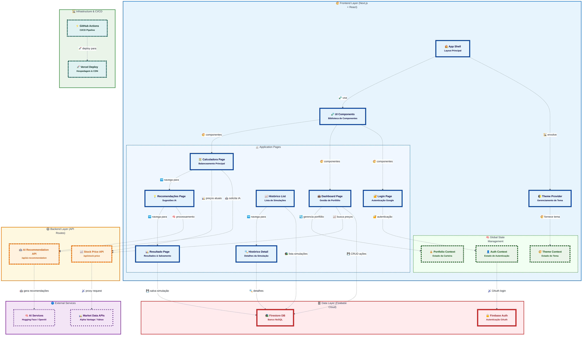

# EquilibreInvest 


**EquilibreInvest** é uma aplicação web projetada para auxiliar no balanceamento de carteiras de investimento em ações. A ideia para este projeto nasceu de uma necessidade pessoal de gerenciar e otimizar meus próprios investimentos de forma mais estratégica e visual.

Além de resolver um desafio pessoal, o desenvolvimento do EquilibreInvest teve um forte componente experimental: o intuito foi explorar e testar as capacidades de uma série de ferramentas e agentes de Inteligência Artificial no ciclo de desenvolvimento de software, desde a concepção da interface até a implementação da lógica de negócios e integração com serviços.

---

## 📋 Sumário

<details>
<summary><strong>🔍 Clique para expandir o sumário completo</strong></summary>

### 🎯 Visão Geral
- [A Jornada com Inteligências Artificiais e Agentes](#a-jornada-com-inteligências-artificiais-e-agentes)
- [Status do Projeto](#status-do-projeto)
- [Principais Funcionalidades](#principais-funcionalidades)

### 🆕 Novidades e Implementações
- [Funcionalidades Recentemente Implementadas](#funcionalidades-recentemente-implementadas)
- [Tecnologias Utilizadas](#tecnologias-utilizadas)
- [Diagrama de Arquitetura](#diagrama-de-arquitetura)

### 🚀 Desenvolvimento
- [Como Rodar Localmente](#como-rodar-localmente)
- [🛠️ Modo de Desenvolvimento](#️-modo-de-desenvolvimento)
- [⚡ Comandos Úteis para Desenvolvedores](#-comandos-úteis-para-desenvolvedores)

### 📚 Recursos e Documentação
- [📚 Documentação](#-documentação)
- [Como Contribuir](#como-contribuir)
- [Licença](#licença)

</details>

---

## A Jornada com Inteligências Artificiais e Agentes

<details>
<summary><strong>🤖 Clique para conhecer a jornada completa com ferramentas de IA</strong></summary>

Um aspecto fundamental deste projeto foi a utilização extensiva do **Gemini (versão 2.5 Pro) da Google**. Meu foco com o Gemini foi em um processo iterativo de criação e otimização de prompts, visando traduzir os requisitos de negócio e as funcionalidades desejadas em instruções claras e eficazes para as demais IAs e agentes subsequentes, estes sim com a capacidade de gerar código. O Gemini atuou como um "arquiteto de prompts", ajudando a refinar a comunicação com as ferramentas de codificação.

A jornada de desenvolvimento de código assistido por IA seguiu algumas etapas:

### 1.  **v0.dev:**

A prototipagem inicial e a primeira versão da interface foram exploradas com o `v0.dev`. Embora promissor para dar o pontapé inicial no design, o projeto encontrou limitações, seja pela ferramenta não atender precisamente aos requisitos esperados em termos de código ou pelas restrições de uso da versão gratuita.

### 2.  **Copilot Workspace (Preview):** 

Em seguida, a exploração continuou com o Copilot Workspace, em sua versão Preview ([https://copilot-workspace.githubnext.com/](https://copilot-workspace.githubnext.com/)). Esta ferramenta, apesar de inovadora, mostrou-se pouco assertiva na geração de soluções robustas para os desafios mais complexos do projeto neste estágio.

### 3.  **Manus AI:** 

A experiência com a Manus AI foi particularmente notável. Esta ferramenta surpreendeu positivamente pela sua capacidade de análise de contexto, compreensão do código existente e pela eficácia na resolução de problemas e implementação de novas funcionalidades. A assertividade da Manus AI foi um diferencial importante. Se não fosse pelo modelo de custo, teria sido a ferramenta de escolha para uma utilização mais integral e contínua no desenvolvimento do EquilibreInvest.

### 4.  **GitHub Copilot (VSCode Integrado com Agents Claude Sonnet):** 

A utilização intensiva do GitHub Copilot (versão Pro) diretamente integrado ao VSCode  foi surpreendente em termos de eficiência e **experiência de desenvolvimento**, especialmente através do chat com os agents, como o Claude Sonnet (versões 3.5 e 4). A capacidade de interagir de forma simples e direta, fornecendo contexto do projeto e recebendo sugestões de código, refatorações e soluções para problemas complexos, superou significativamente as ferramentas anteriores. A assertividade e a qualidade do código gerado, combinadas com a fluidez da integração no editor, tornaram o processo de desenvolvimento muito mais ágil e produtivo.

### Intervenção Manual

É importante salientar que, embora o objetivo fosse maximizar o uso de IAs para a geração de código, intervenções manuais foram necessárias em momentos pontuais. Esses ajustes ocorreram principalmente para corrigir pequenas inconsistências, integrar as saídas das diferentes ferramentas, ou refinar detalhes específicos da lógica de negócios, especialmente antes da fase de utilização da Manus AI, que demonstrou maior autonomia na compreensão e modificação da base de código existente. Contudo, com a adoção do Copilot integrado ao VSCode e seus agents, a necessidade de intervenção manual diminuiu consideravelmente, focando mais em revisões estratégicas e ajustes finos.

Este projeto é, portanto, um reflexo tanto de uma necessidade prática quanto de uma exploração contínua das fronteiras do desenvolvimento de software assistido por inteligência artificial.

</details>

---

## Status do Projeto

**✅ Versão Estável com Modo de Desenvolvimento Completo** 

O projeto está **funcionalmente completo** com todas as funcionalidades core implementadas e testadas:

### 🚀 Funcionalidades Core
- ✅ **Sistema de Autenticação** completo com Firebase
- ✅ **Gerenciamento de Carteira** com CRUD completo de ativos
- ✅ **Calculadora de Balanceamento** funcional com simulações avançadas
- ✅ **Histórico de Simulações** para acompanhamento temporal detalhado
- ✅ **Dashboard Interativo** com gráficos e insights em tempo real
- ✅ **Interface Responsiva** com tema escuro/claro
- ✅ **Watchlist** para acompanhamento de ativos de interesse

### 🛠️ Recursos de Desenvolvimento
- ✅ **Modo de Desenvolvimento Offline** - Execução completa sem dependências externas
- ✅ **Suite de Testes** com Jest e React Testing Library
- ✅ **Documentação Técnica** organizada e completa
- ✅ **Diagramas de Arquitetura** em alta qualidade
- ✅ **CI/CD Pipeline** configurado

### 📊 Qualidade e Manutenibilidade
- ✅ **TypeScript** com tipagem rigorosa
- ✅ **Validação de Dados** com Zod schemas
- ✅ **Error Boundaries** e tratamento de erros robusto
- ✅ **Performance Otimizada** com React.memo e lazy loading
- ✅ **Acessibilidade** seguindo padrões WCAG

O projeto está em **estado de produção** e continua recebendo melhorias incrementais focadas em otimização da experiência do usuário e recursos avançados de análise.

---

## Principais Funcionalidades

<details>
<summary><strong>🎯 Clique para ver todas as funcionalidades principais</strong></summary>

* **Autenticação Segura:** Login com conta Google (Gmail) via Firebase Authentication.
* **Gerenciamento de Carteira:**
    * Cadastro, visualização, edição e exclusão de ativos (ações).
    * Definição de percentuais meta para cada ativo.
    * Input manual de "Recomendação Própria" ('Comprar', 'Manter', 'Evitar Aporte') para guiar decisões.
* **Calculadora de Balanceamento:**
    * Sugestão de quanto investir em cada ativo para alcançar o balanceamento desejado com novos aportes, considerando as recomendações do usuário e o valor disponível para o aporte.
    * Simulação completa com cálculo de novas alocações e impacto no portfólio.
* **Histórico de Simulações:**
    * Salvamento automático de todas as simulações de balanceamento realizadas.
    * Visualização completa do histórico ordenado por data.
    * Detalhamento individual de cada simulação com métricas de performance.
    * Acompanhamento da evolução das decisões de investimento ao longo do tempo.
    * Interface intuitiva para revisar alocações passadas e resultados obtidos.
* **Dashboard Intuitivo:**
    * Painel de resumo com valor total da carteira, total de ativos.
    * Gráficos de composição (percentual atual vs. meta).
    * "Equilibra Insights": Dicas e observações personalizadas (baseadas em regras e na configuração da carteira) sobre a carteira, como alertas de desbalanceamento significativo, sugestões de ativos para foco com base nas metas, ou observações sobre a diversificação.
* **Visualização e Organização:**
    * Cards de ativos detalhados.
    * Opções de ordenação para os ativos listados.
    * Interface responsiva e moderna com tema escuro/claro.
* **Lista de Observação (Watchlist):** Acompanhamento de ativos de interesse.
* **Perfil de Usuário:** Configurações básicas e gerenciamento da conta.

</details>

---

## Funcionalidades Recentemente Implementadas

### 🆕 Sistema Completo de Histórico de Simulações
Uma das mais importantes adições ao EquilibreInvest é o sistema completo de histórico de simulações:

* **Registro Automático:** Todas as simulações são salvas automaticamente no Firebase Firestore
* **Visualização Cronológica:** Interface dedicada (`/historico`) com listagem ordenada por data
* **Detalhamento Completo:** Cada simulação individual (`/historico/[id]`) inclui:
  - Resumo financeiro (valor investido, valor antes/depois, variação percentual)
  - Lista detalhada de todas as alocações por ativo
  - Recomendações aplicadas (Comprar/Vender/Aguardar)
  - Métricas de quantidade de ações e preços históricos
* **Controle de Performance:** Acompanhamento da evolução das decisões ao longo do tempo
* **Interface Intuitiva:** Design responsivo com tratamento completo de estados

### 🛠️ Modo de Desenvolvimento Offline Completo
Sistema revolucionário que permite desenvolvimento local sem dependências externas:

* **🔐 Autenticação Mock:** Sistema completo de bypass do Firebase Auth
* **📊 Dados Simulados:** Portfolio pré-configurado com ações reais (AAPL, GOOGL, MSFT, AMZN, TSLA)
* **💰 Preços Mockados:** Cotações realistas para demonstração e desenvolvimento
* **📈 Watchlist Simulada:** Lista de acompanhamento com NVDA e META
* **🔄 Histórico de Exemplo:** 2 simulações de balanceamento pré-configuradas
* **⚡ Zero Dependências:** Funciona completamente offline com dados consistentes

### 📋 Documentação e Qualidade Reorganizadas
Reestruturação completa da documentação para melhor organização:

* **📁 Estrutura Hierárquica:** Documentação organizada em `docs/` com categorias claras
* **🎨 Diagramas de Alta Qualidade:** Configuração otimizada do Mermaid CLI (5712x3009px)
* **🔧 Guias Técnicos:** Documentação detalhada do modo de desenvolvimento
* **📊 Arquitetura Visual:** Diagrama interativo com links para código-fonte

### 🔄 Fluxo Completo de Simulação
```
Calculadora → Configuração → Resultado → Salvar → Histórico → Detalhes
```

### 🎨 Melhorias na Interface e UX
* **Estados Visuais:** Loading, sucesso e erro com feedback claro
* **Badges Informativos:** Identificação visual de ganhos/perdas e recomendações
* **Navegação Fluida:** Transições suaves com breadcrumbs e botões de volta
* **Responsividade Total:** Funciona perfeitamente em desktop, tablet e mobile
* **Tema Adaptativo:** Sistema completo de tema claro/escuro

---

## Tecnologias Utilizadas

### 🎨 Frontend
* **Framework:** React, Next.js 14 (App Router)
* **UI/UX:** Tailwind CSS, Radix UI, Lucide Icons
* **Estado:** Context API, React Hooks
* **Gráficos:** Recharts
* **Linguagem:** TypeScript

### 🔐 Backend e Dados
* **Autenticação:** Firebase Authentication (Google Provider)
* **Banco de Dados:** Firebase Firestore (NoSQL, em nuvem)
* **API de Cotações:** Alpha Vantage, Yahoo Finance
* **Validação:** Zod (Type-safe schemas)

### 🔧 Desenvolvimento e Qualidade
* **Testes:** Jest, React Testing Library
* **Notificações:** Sonner (Toast notifications)
* **Documentação:** Mermaid.js (diagramas), Markdown
* **Deploy:** Vercel
* **Modo Offline:** Sistema mock completo para desenvolvimento

### 🤖 Ferramentas de IA
* **Geração de Código:** v0.dev, Copilot Workspace, Manus AI, GitHub Copilot (Claude Sonnet)
* **Otimização de Prompts:** Gemini 2.5 Pro (Google)

---

## Diagrama de Arquitetura

O diagrama abaixo ilustra a arquitetura completa do EquilibreInvest, incluindo os principais componentes, fluxos de dados e suas interações:



> 📋 **Configuração de Qualidade**: Para detalhes sobre como os diagramas são gerados com alta qualidade e configurações personalizadas, consulte [docs/config/MERMAID_QUALITY_CONFIG.md](docs/config/MERMAID_QUALITY_CONFIG.md).

### 🏗️ Principais Componentes

| Camada | Componentes | Responsabilidade |
|--------|-------------|------------------|
| **Frontend** | React + Next.js 14 | Interface do usuário e roteamento |
| **Estado Global** | Context API | Gerenciamento de autenticação, portfólio e tema |
| **APIs Internas** | `/api/stock-price`, `/api/ai-recommendation` | Proxy para serviços externos |
| **Dados** | Firebase Firestore | Persistência de carteiras e simulações |
| **Autenticação** | Firebase Auth | Login social com Google |
| **Serviços Externos** | Alpha Vantage, Yahoo Finance | Cotações em tempo real |

### 🔄 Fluxos de Dados

1. **Autenticação**: Google OAuth → Firebase Auth → Context Global
2. **Cotações**: APIs Externas → Route Handlers → Frontend
3. **Portfólio**: Frontend → Firestore → Context Global
4. **Simulações**: Calculadora → Resultado → Firestore → Histórico

---

## Como Rodar Localmente

Para rodar este projeto em seu ambiente local, escolha entre o **modo completo** (com dependências reais) ou o **modo de desenvolvimento** (offline com dados mock).

<details>
<summary><strong>🚀 Setup Inicial (Obrigatório)</strong></summary>

### 1. Clone e instale dependências

```bash
# Clone o repositório
git clone https://github.com/rosanarezende/balanceamento-de-investimentos.git
cd balanceamento-de-investimentos

# Instale as dependências
npm install
# ou
yarn install
```

### 2. Crie o arquivo de configuração

```bash
# Copie o template de configuração
cp .env.example .env.local
```

**⚠️ Importante**: O arquivo `.env.local` é obrigatório para executar a aplicação.

</details>

<details>
<summary><strong>🔧 Opção 1: Modo de Desenvolvimento (Recomendado)</strong></summary>

### Para desenvolvimento rápido sem dependências externas

**Configure no `.env.local`:**
```env
# Modo de desenvolvimento (bypass de todas as dependências externas)
NEXT_PUBLIC_DEVELOPMENT_MODE=true
NEXT_PUBLIC_MOCK_AUTH=true
NEXT_PUBLIC_MOCK_DATA=true
```

**Execute a aplicação:**
```bash
npm run dev
# ou 
yarn dev
```

### ✅ Vantagens do modo de desenvolvimento:
- ⚡ **Setup instantâneo** - não precisa configurar Firebase ou APIs
- 🔄 **Dados mock realistas** - simula portfólios e preços de ações
- 🛡️ **Autenticação simulada** - login automático para testes
- 📱 **Todas as funcionalidades** - interface completa disponível

### 📋 O que funciona offline:
- Calculadora de balanceamento
- Gerenciamento de carteira
- Recomendações de IA (simuladas)
- Histórico de operações
- Interface completa

</details>

<details>
<summary><strong>🌐 Opção 2: Modo Completo (Produção)</strong></summary>

### Para uso com dados reais e APIs externas

**Configure no `.env.local`:**

#### Firebase (Obrigatórias)
```env
NEXT_PUBLIC_FIREBASE_API_KEY=seu_valor_aqui
NEXT_PUBLIC_FIREBASE_AUTH_DOMAIN=seu_valor_aqui
NEXT_PUBLIC_FIREBASE_PROJECT_ID=seu_valor_aqui
NEXT_PUBLIC_FIREBASE_STORAGE_BUCKET=seu_valor_aqui
NEXT_PUBLIC_FIREBASE_MESSAGING_SENDER_ID=seu_valor_aqui
NEXT_PUBLIC_FIREBASE_APP_ID=seu_valor_aqui
NEXT_PUBLIC_FIREBASE_MEASUREMENT_ID=seu_valor_aqui
```

#### APIs Externas (Obrigatórias)
```env
ALPHA_VANTAGE_API_KEY=seu_valor_aqui
HF_API_KEY=seu_valor_aqui
```

#### Configurações do Modo
```env
NEXT_PUBLIC_DEVELOPMENT_MODE=false
NEXT_PUBLIC_MOCK_AUTH=false
NEXT_PUBLIC_MOCK_DATA=false
```

**Execute a aplicação:**
```bash
npm run dev
```

### 🔑 Como obter as credenciais:
- **Firebase**: [Console Firebase](https://console.firebase.google.com/)
- **Alpha Vantage**: [Portal de desenvolvedores](https://www.alphavantage.co/support/#api-key)
- **Hugging Face**: [Configurações da conta](https://huggingface.co/settings/tokens)

</details>

<details>
<summary><strong>📱 Acesso à Aplicação</strong></summary>

### Depois de configurado, acesse:

**URL Local:** [http://localhost:3000](http://localhost:3000)

### 🔍 Verificações pós-instalação:
1. **Página inicial carrega** ✅
2. **Calculadora funciona** ✅
3. **Login/cadastro disponível** ✅
4. **Dados aparecem corretamente** ✅

### 🐛 Problemas comuns:
- **Erro de porta ocupada**: Mude para `npm run dev -- -p 3001`
- **Variáveis não encontradas**: Verifique se `.env.local` está na raiz
- **Build falha**: Execute `npm run build` para diagnóstico detalhado

</details>

---

## 🛠️ Modo de Desenvolvimento

Para facilitar o desenvolvimento local sem dependências externas, a aplicação possui um **modo de desenvolvimento** que permite executar todas as funcionalidades usando dados simulados.

> 📋 **Documentação Completa**: Para informações detalhadas sobre o modo de desenvolvimento, configuração e funcionalidades, consulte [docs/technical/DEVELOPMENT_MODE.md](docs/technical/DEVELOPMENT_MODE.md).

### Configuração do Modo de Desenvolvimento

1. **Configure as variáveis de ambiente** no arquivo `.env.local`:
   ```bash
   # Modo de desenvolvimento (bypass de todas as dependências externas)
   NEXT_PUBLIC_DEVELOPMENT_MODE=true
   NEXT_PUBLIC_MOCK_AUTH=true
   NEXT_PUBLIC_MOCK_DATA=true
   ```

2. **Execute a aplicação**:
   ```bash
   npm run dev
   ```

### O que o Modo de Desenvolvimento Oferece

- **🔐 Autenticação Simulada**: Bypass completo do Firebase Auth
- **📊 Dados Mock de Carteira**: Portfolio pré-configurado com ações populares (AAPL, GOOGL, MSFT, AMZN, TSLA)
- **💰 Preços Simulados**: Cotações mockadas para todas as ações
- **📈 Watchlist Mock**: Lista de acompanhamento pré-configurada
- **🔄 Simulações de Balanceamento**: Histórico de simulações para demonstração
- **⚡ Sem Dependências Externas**: Funciona completamente offline

### Dados de Demonstração

O modo de desenvolvimento inclui:

- **Usuário Mock**: `dev@example.com` (Usuário Desenvolvimento)
- **Portfolio**: 5 ações com alocações e recomendações
- **Preços**: Valores realistas para demonstração
- **Watchlist**: NVDA e META com preços-alvo
- **Simulações**: Histórico de 2 simulações exemplo

### Logs de Desenvolvimento

Quando ativo, o modo de desenvolvimento gera logs informativos no console do navegador:
```
[DEV MODE] Usando dados mock para portfólio
[DEV MODE] Usando preços mock para múltiplas ações: AAPL, GOOGL, MSFT
```

### Desabilitando o Modo de Desenvolvimento

Para usar a aplicação com dados reais:
1. Defina `NEXT_PUBLIC_DEVELOPMENT_MODE=false` no `.env.local`
2. Configure todas as credenciais do Firebase e APIs externas
3. Reinicie a aplicação

---

## ⚡ Comandos Úteis para Desenvolvedores

<details>
<summary><strong>🚀 Desenvolvimento</strong></summary>

```bash
# Executar em modo de desenvolvimento
npm run dev

# Executar com modo offline ativo
NEXT_PUBLIC_DEVELOPMENT_MODE=true npm run dev

# Build para produção
npm run build

# Visualizar build de produção
npm run start
```

**Dicas:**
- Use `NEXT_PUBLIC_DEVELOPMENT_MODE=true` para desenvolvimento offline
- O comando `npm run build` verifica erros de TypeScript
- `npm run start` serve a versão otimizada de produção

</details>

<details>
<summary><strong>🧪 Testes</strong></summary>

```bash
# Executar todos os testes
npm run test

# Executar testes em modo watch
npm run test:watch

# Executar testes com coverage
npm run test:coverage
```

**Sobre os testes:**
- Framework: Jest + React Testing Library
- Coverage mínimo recomendado: 80%
- Testes executam com dados mock automaticamente

</details>

<details>
<summary><strong>📊 Diagramas</strong></summary>

```bash
# Gerar diagrama PNG em alta qualidade
npm run generate-diagram

# Gerar diagrama SVG vetorial
npm run generate-diagram:svg

# Gerar ambos com arquivamento automático
npm run generate-diagram:both
```

**Configuração:**
- Fonte: `docs/arquitetura.mmd`
- Qualidade: 4K (4096x3072px) para PNG
- Output: `docs/` com backup em `docs/arquivo/`

</details>

<details>
<summary><strong>🔍 Qualidade de Código</strong></summary>

```bash
# Linting com ESLint
npm run lint

# Verificar formatação com Prettier
npm run format:check

# Aplicar formatação com Prettier
npm run format
```

**Padrões de código:**
- ESLint: Configuração estrita para React/TypeScript
- Prettier: Formatação automática consistente
- Hooks: Linting específico para React Hooks

</details>

---

## Como Contribuir

Contribuições são muito bem-vindas! Este projeto foi desenvolvido com foco em aprendizado e experimentação com IAs, mas está aberto para melhorias da comunidade.

<details>
<summary><strong>🚀 Processo de Contribuição</strong></summary>

### Passo a passo para contribuir:

1. **Fork** o projeto e clone localmente
2. **Configure o ambiente** com o modo de desenvolvimento:
   ```bash
   cp .env.example .env.local
   # Configure NEXT_PUBLIC_DEVELOPMENT_MODE=true para desenvolvimento
   npm install && npm run dev
   ```
3. **Crie uma branch** para sua feature: `git checkout -b feature/MinhaNovaFeature`
4. **Desenvolva e teste** suas mudanças
5. **Documente** alterações na arquitetura atualizando `docs/arquitetura.mmd`
6. **Execute os testes**: `npm run test`
7. **Envie um Pull Request** com descrição detalhada

### Checklist antes do PR:
- [ ] ✅ Testes passando (`npm run test`)
- [ ] 🔍 Código linted (`npm run lint`)
- [ ] 📝 Documentação atualizada
- [ ] 📊 Diagramas regenerados se aplicável

</details>

<details>
<summary><strong>📋 Tipos de Contribuição</strong></summary>

### Contribuições aceitas:

| Tipo | Descrição | Prioridade |
|------|-----------|------------|
| **🐛 Correção de Bugs** | Issues identificadas ou melhorias de performance | 🔴 Alta |
| **✨ Novas Funcionalidades** | Recursos que agregam valor ao usuário | 🟡 Média |
| **📚 Documentação** | Melhorias na documentação técnica ou de usuário | 🟢 Baixa |
| **🧪 Testes** | Aumento da cobertura de testes ou melhoria da qualidade | 🟡 Média |
| **🎨 Interface** | Melhorias na UX/UI ou acessibilidade | 🟡 Média |
| **🔧 Infraestrutura** | Otimizações de build, CI/CD ou configurações | 🟢 Baixa |

### Áreas de foco prioritário:
- Otimização de performance
- Acessibilidade (WCAG)
- Testes automatizados
- Documentação técnica

</details>

<details>
<summary><strong>💡 Diretrizes de Desenvolvimento</strong></summary>

### Padrões obrigatórios:
- ✅ **TypeScript**: Tipagem rigorosa obrigatória
- ✅ **ESLint + Prettier**: Seguir configuração existente
- ✅ **React Hooks**: Usar apenas hooks funcionais
- ✅ **Responsividade**: Mobile-first design

### Estrutura de commits:
```
feat: adiciona nova funcionalidade X
fix: corrige bug na calculadora
docs: atualiza README com novas instruções
test: adiciona testes para componente Y
style: ajusta formatação do código
refactor: melhora estrutura do componente Z
```

### Convenções de naming:
- **Componentes**: `PascalCase` (ex: `PortfolioCalculator`)
- **Hooks**: `camelCase` com prefixo `use` (ex: `usePortfolioData`)
- **Utilities**: `camelCase` (ex: `calculateOptimalAllocation`)
- **Constants**: `SCREAMING_SNAKE_CASE` (ex: `MAX_ALLOCATION_PERCENTAGE`)

</details>
- Adicione testes para novas funcionalidades
- Atualize a documentação quando necessário

Toda ajuda é apreciada, especialmente considerando a natureza experimental e de aprendizado deste projeto! 🚀

---

## 📚 Documentação

A documentação completa do projeto está organizada e estruturada na pasta [`docs/`](docs/README.md):

### 📋 Documentação Técnica
- **[Modo de Desenvolvimento](docs/technical/DEVELOPMENT_MODE.md)** - Guia completo para execução offline sem dependências
- **[Configuração de Diagramas](docs/config/MERMAID_QUALITY_CONFIG.md)** - Setup avançado para Mermaid com alta qualidade

### 📊 Arquitetura e Visão Geral
- **[Compilado do Projeto](docs/general/COMPILADO_PROJETO.md)** - Visão completa do projeto, melhorias e evolução
- **[Diagrama de Arquitetura](docs/arquitetura.png)** - Representação visual da estrutura do sistema (5712x3009px)

### 🔧 Recursos para Desenvolvedores
- **[Código-fonte dos Diagramas](docs/arquitetura.mmd)** - Arquivos Mermaid editáveis e versionados
- **[Configurações de Qualidade](docs/mermaid-cli.json)** - Configurações otimizadas do Mermaid CLI
- **[Arquivo de Versões](docs/arquivo/)** - Histórico completo de versões dos diagramas
- **[Sumário de Reorganização](docs/REORGANIZATION_SUMMARY.md)** - Documentação das melhorias estruturais

### 🎯 Início Rápido por Perfil
- **Desenvolvedores**: Comece com [Modo de Desenvolvimento](docs/technical/DEVELOPMENT_MODE.md)
- **Contribuidores**: Veja [Compilado do Projeto](docs/general/COMPILADO_PROJETO.md)  
- **Arquitetos**: Consulte [Configuração de Diagramas](docs/config/MERMAID_QUALITY_CONFIG.md)

> 💡 **Dica**: A documentação é versionada e mantida sincronizada com o desenvolvimento. Use o comando `npm run generate-diagram` para atualizar os diagramas após mudanças na arquitetura.

---

## Licença

Este projeto é disponibilizado sob a **Licença MIT**.

Isso significa que você tem permissão para:
* Usar o software para qualquer propósito (incluindo fins comerciais, embora o intuito original deste projeto seja para estudo e uso não lucrativo).
* Modificar o software para atender às suas necessidades.
* Distribuir cópias do software.
* Distribuir cópias de suas versões modificadas.

A única exigência é que o aviso de copyright e esta permissão de licença sejam incluídos em todas as cópias ou partes substanciais do software.

[Clique aqui para ver o texto completo da Licença MIT](https://opensource.org/licenses/MIT)

