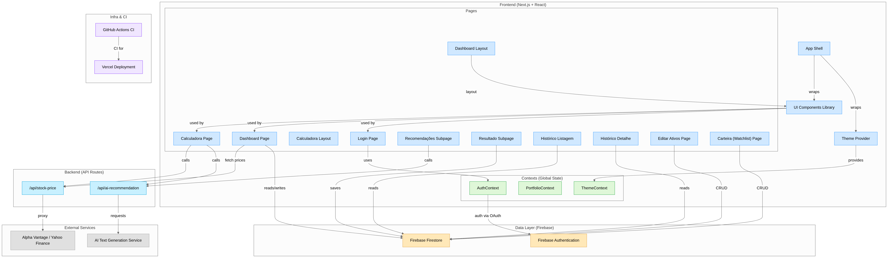

# EquilibreInvest 

[](https://vercel.com/rosana-rezendes-projects/v0-investir-para-o-futuro)
[](https://v0.dev/chat/projects/QNdp8n2hReh)


**EquilibreInvest** é uma aplicação web projetada para auxiliar no balanceamento de carteiras de investimento em ações. A ideia para este projeto nasceu de uma necessidade pessoal de gerenciar e otimizar meus próprios investimentos de forma mais estratégica e visual.

Além de resolver um desafio pessoal, o desenvolvimento do EquilibreInvest teve um forte componente experimental: o intuito foi explorar e testar as capacidades de uma série de ferramentas e agentes de Inteligência Artificial no ciclo de desenvolvimento de software, desde a concepção da interface até a implementação da lógica de negócios e integração com serviços.

## A Jornada com Inteligências Artificiais e Agentes

Um aspecto fundamental deste projeto foi a utilização extensiva do **Gemini (versão 2.5 Pro) da Google**. Meu foco com o Gemini foi em um processo iterativo de criação e otimização de prompts, visando traduzir os requisitos de negócio e as funcionalidades desejadas em instruções claras e eficazes para as demais IAs e agentes subsequentes, estes sim com a capacidade de gerar código. O Gemini atuou como um "arquiteto de prompts", ajudando a refinar a comunicação com as ferramentas de codificação.

A jornada de desenvolvimento de código assistido por IA seguiu algumas etapas:

1.  **v0.dev:** A prototipagem inicial e a primeira versão da interface foram exploradas com o `v0.dev`. Embora promissor para dar o pontapé inicial no design, o projeto encontrou limitações, seja pela ferramenta não atender precisamente aos requisitos esperados em termos de código ou pelas restrições de uso da versão gratuita.
2.  **Copilot Workspace (Preview):** Em seguida, a exploração continuou com o Copilot Workspace, em sua versão Preview ([https://copilot-workspace.githubnext.com/](https://copilot-workspace.githubnext.com/)). Esta ferramenta, apesar de inovadora, mostrou-se pouco assertiva na geração de soluções robustas para os desafios mais complexos do projeto neste estágio.
3.  **Manus AI:** A experiência com a Manus AI foi particularmente notável. Esta ferramenta surpreendeu positivamente pela sua capacidade de análise de contexto, compreensão do código existente e pela eficácia na resolução de problemas e implementação de novas funcionalidades. A assertividade da Manus AI foi um diferencial importante. Se não fosse pelo modelo de custo, teria sido a ferramenta de escolha para uma utilização mais integral e contínua no desenvolvimento do EquilibreInvest.
4.  **GitHub Copilot (VSCode Integrado com Agents Claude Sonnet):** A verdadeira virada de chave em termos de eficiência e experiência de desenvolvimento ocorreu com a utilização intensiva do GitHub Copilot (versão Pro) diretamente integrado ao VSCode, especialmente através do chat com os agents, como o Claude Sonnet (versões 3.5 e 4). A capacidade de interagir de forma simples e direta, fornecendo contexto do projeto e recebendo sugestões de código, refatorações e soluções para problemas complexos, superou significativamente as ferramentas anteriores. A assertividade e a qualidade do código gerado, combinadas com a fluidez da integração no editor, tornaram o processo de desenvolvimento muito mais ágil e produtivo.

## Intervenção Manual

É importante salientar que, embora o objetivo fosse maximizar o uso de IAs para a geração de código, intervenções manuais foram necessárias em momentos pontuais. Esses ajustes ocorreram principalmente para corrigir pequenas inconsistências, integrar as saídas das diferentes ferramentas, ou refinar detalhes específicos da lógica de negócios, especialmente antes da fase de utilização da Manus AI, que demonstrou maior autonomia na compreensão e modificação da base de código existente. Contudo, com a adoção do Copilot integrado ao VSCode e seus agents, a necessidade de intervenção manual diminuiu consideravelmente, focando mais em revisões estratégicas e ajustes finos.

Este projeto é, portanto, um reflexo tanto de uma necessidade prática quanto de uma exploração contínua das fronteiras do desenvolvimento de software assistido por inteligência artificial.

---

## Status do Projeto

**Em Desenvolvimento Ativo com Funcionalidades Core Implementadas.** 

O projeto possui agora um conjunto robusto de funcionalidades essenciais:
- ✅ **Sistema de Autenticação** completo com Firebase
- ✅ **Gerenciamento de Carteira** com CRUD completo de ativos
- ✅ **Calculadora de Balanceamento** funcional com simulações
- ✅ **Histórico de Simulações** para acompanhamento temporal
- ✅ **Dashboard Interativo** com gráficos e insights
- ✅ **Interface Responsiva** com tema escuro/claro

O projeto está continuamente recebendo novas funcionalidades e melhorias, com foco em otimização da experiência do usuário e implementação de recursos avançados de análise de investimentos.

---

## Principais Funcionalidades

* **Autenticação Segura:** Login com conta Google (Gmail) via Firebase Authentication.
* **Gerenciamento de Carteira:**
    * Cadastro, visualização, edição e exclusão de ativos (ações).
    * Definição de percentuais meta para cada ativo.
    * Input manual de "Recomendação Própria" ('Comprar', 'Manter', 'Evitar Aporte') para guiar decisões.
* **Calculadora de Balanceamento:**
    * Sugestão de quanto investir em cada ativo para alcançar o balanceamento desejado com novos aportes, considerando as recomendações do usuário e o valor disponível para o aporte.
    * Simulação completa com cálculo de novas alocações e impacto no portfólio.
* **Histórico de Simulações:**
    * Salvamento automático de todas as simulações de balanceamento realizadas.
    * Visualização completa do histórico ordenado por data.
    * Detalhamento individual de cada simulação com métricas de performance.
    * Acompanhamento da evolução das decisões de investimento ao longo do tempo.
    * Interface intuitiva para revisar alocações passadas e resultados obtidos.
* **Dashboard Intuitivo:**
    * Painel de resumo com valor total da carteira, total de ativos.
    * Gráficos de composição (percentual atual vs. meta).
    * "Equilibra Insights": Dicas e observações personalizadas (baseadas em regras e na configuração da carteira) sobre a carteira, como alertas de desbalanceamento significativo, sugestões de ativos para foco com base nas metas, ou observações sobre a diversificação.
* **Visualização e Organização:**
    * Cards de ativos detalhados.
    * Opções de ordenação para os ativos listados.
    * Interface responsiva e moderna com tema escuro/claro.
* **Lista de Observação (Watchlist):** Acompanhamento de ativos de interesse.
* **Perfil de Usuário:** Configurações básicas e gerenciamento da conta.

---

## Funcionalidades Recentemente Implementadas

### 🆕 Sistema Completo de Histórico de Simulações
Uma das mais importantes adições ao EquilibreInvest é o sistema completo de histórico de simulações, que permite aos usuários:

* **Registro Automático:** Todas as simulações de balanceamento são automaticamente salvas no Firebase Firestore.
* **Visualização Cronológica:** Interface dedicada (`/historico`) que lista todas as simulações ordenadas por data mais recente.
* **Detalhamento Completo:** Cada simulação pode ser visualizada individualmente (`/historico/[id]`) com:
  - Resumo financeiro (valor investido, valor antes/depois, variação percentual)
  - Lista detalhada de todas as alocações por ativo
  - Recomendações aplicadas (Comprar/Vender/Aguardar)
  - Métricas de quantidade de ações e preços
* **Controle de Performance:** Acompanhamento da evolução das decisões de investimento ao longo do tempo.
* **Interface Intuitiva:** Design responsivo com estados de loading, erro e dados vazios bem tratados.

### 🔄 Fluxo Completo de Simulação
O fluxo de simulação agora está totalmente integrado:
```
Calculadora → Configuração → Resultado → Salvar → Histórico → Detalhes
```

### 🎨 Melhorias na Interface
* **Estados Visuais:** Indicadores claros de loading, sucesso e erro
* **Badges Informativos:** Identificação visual de ganhos/perdas e recomendações
* **Navegação Fluida:** Transições suaves entre páginas com botões de volta
* **Responsividade:** Interface que funciona perfeitamente em desktop e mobile

---

## Tecnologias Utilizadas

* **Frontend:** React, Next.js 14 (App Router)
* **Autenticação:** Firebase Authentication (Google Provider)
* **Banco de Dados:** Firebase Firestore (NoSQL, em nuvem)
* **API de Cotações:** Alpha Vantage, Yahoo Finance
* **UI/UX:** Tailwind CSS, Radix UI, Lucide Icons
* **Estado:** Context API, React Hooks
* **Validação:** Zod (Type-safe schemas)
* **Notificações:** Sonner (Toast notifications)
* **Gráficos:** Recharts
* **Hospedagem/Deploy:** Vercel
* **Linguagem Principal:** TypeScript
* **Ferramentas de IA para Geração/Prototipagem de Código:** v0.dev, Copilot Workspace, Manus AI, GitHub Copilot (Claude Sonnet)
* **Otimização de Prompts:** Gemini 2.5 Pro (Google)

---

## Diagrama de Arquitetura

Este diagrama foi criado com o Mermaid.js e hospedado no site [GitDiagram](https://gitdiagram.com/rosanarezende/balanceamento-de-investimentos). Ele ilustra a arquitetura do EquilibreInvest, incluindo os principais componentes e suas interações.

```mermaid
flowchart TB
    %% Frontend Layer
    subgraph "Frontend (Next.js + React)"
        direction TB
        AppShell["App Shell"]:::ui
        ThemeProvider["Theme Provider"]:::ui
        UIComponents["UI Components Library"]:::ui

        subgraph "Pages"
            direction TB
            LoginPage["Login Page"]:::ui
            DashboardLayout["Dashboard Layout"]:::ui
            DashboardPage["Dashboard Page"]:::ui
            CalculadoraLayout["Calculadora Layout"]:::ui
            CalculadoraPage["Calculadora Page"]:::ui
            RecomendacoesPage["Recomendações Subpage"]:::ui
            ResultadoPage["Resultado Subpage"]:::ui
            HistoricoList["Histórico Listagem"]:::ui
            HistoricoDetail["Histórico Detalhe"]:::ui
            EditarAtivos["Editar Ativos Page"]:::ui
            CarteiraPage["Carteira (Watchlist) Page"]:::ui
        end

        subgraph "Contexts (Global State)"
            direction TB
            AuthContext["AuthContext"]:::service
            PortfolioContext["PortfolioContext"]:::service
            ThemeContext["ThemeContext"]:::service
        end
    end

    %% Backend/API Layer
    subgraph "Backend (API Routes)" 
        direction TB
        StockPriceAPI["/api/stock-price"]:::api
        AIRecAPI["/api/ai-recommendation"]:::api
    end

    %% Data Layer
    subgraph "Data Layer (Firebase)" 
        direction TB
        FirebaseAuth["Firebase Authentication"]:::data
        FirestoreDB["Firebase Firestore"]:::data
    end

    %% External Services
    subgraph "External Services" 
        direction TB
        MarketDataAPI["Alpha Vantage / Yahoo Finance"]:::external
        AIService["AI Text Generation Service"]:::external
    end

    %% Infrastructure
    subgraph "Infra & CI"
        direction TB
        Vercel["Vercel Deployment"]:::infra
        GitHubActions["GitHub Actions CI"]:::infra
    end

    %% Data Flows
    LoginPage -->|uses| AuthContext
    AuthContext -->|auth via OAuth| FirebaseAuth
    DashboardPage -->|reads/writes| FirestoreDB
    DashboardPage -->|fetch prices| StockPriceAPI
    DashboardLayout -->|layout| UIComponents
    CalculadoraPage -->|calls| AIRecAPI
    CalculadoraPage -->|calls| StockPriceAPI
    RecomendacoesPage -->|calls| AIRecAPI
    ResultadoPage -->|saves| FirestoreDB
    HistoricoList -->|reads| FirestoreDB
    HistoricoDetail -->|reads| FirestoreDB
    EditarAtivos -->|CRUD| FirestoreDB
    CarteiraPage -->|CRUD| FirestoreDB

    StockPriceAPI -->|proxy| MarketDataAPI
    AIRecAPI -->|requests| AIService

    AppShell -->|wraps| ThemeProvider
    AppShell -->|wraps| UIComponents
    ThemeProvider -->|provides| ThemeContext
    UIComponents -->|used by| LoginPage
    UIComponents -->|used by| DashboardPage
    UIComponents -->|used by| CalculadoraPage

    GitHubActions -->|CI for| Vercel

    %% Click Events
    click AppShell "https://github.com/rosanarezende/balanceamento-de-investimentos/blob/main/src/app/layout.tsx"
    click ThemeProvider "https://github.com/rosanarezende/balanceamento-de-investimentos/blob/main/src/components/theme-provider.tsx"
    click UIComponents "https://github.com/rosanarezende/balanceamento-de-investimentos/tree/main/src/components/ui/"
    click LoginPage "https://github.com/rosanarezende/balanceamento-de-investimentos/blob/main/src/app/login/page.tsx"
    click DashboardLayout "https://github.com/rosanarezende/balanceamento-de-investimentos/blob/main/src/app/dashboard/layout.tsx"
    click DashboardPage "https://github.com/rosanarezende/balanceamento-de-investimentos/blob/main/src/app/dashboard/page.tsx"
    click CalculadoraLayout "https://github.com/rosanarezende/balanceamento-de-investimentos/blob/main/src/app/calculadora-balanceamento/layout.tsx"
    click CalculadoraPage "https://github.com/rosanarezende/balanceamento-de-investimentos/blob/main/src/app/calculadora-balanceamento/page.tsx"
    click RecomendacoesPage "https://github.com/rosanarezende/balanceamento-de-investimentos/blob/main/src/app/calculadora-balanceamento/recomendacoes/page.tsx"
    click ResultadoPage "https://github.com/rosanarezende/balanceamento-de-investimentos/blob/main/src/app/calculadora-balanceamento/resultado/page.tsx"
    click HistoricoList "https://github.com/rosanarezende/balanceamento-de-investimentos/blob/main/src/app/historico/page.tsx"
    click HistoricoDetail "https://github.com/rosanarezende/balanceamento-de-investimentos/blob/main/src/app/historico/[id]/page.tsx"
    click EditarAtivos "https://github.com/rosanarezende/balanceamento-de-investimentos/blob/main/src/app/editar-ativos/page.tsx"
    click CarteiraPage "https://github.com/rosanarezende/balanceamento-de-investimentos/blob/main/src/app/carteira/page.tsx"
    click AuthContext "https://github.com/rosanarezende/balanceamento-de-investimentos/blob/main/src/core/state/auth-context.tsx"
    click PortfolioContext "https://github.com/rosanarezende/balanceamento-de-investimentos/blob/main/src/core/state/portfolio-context.tsx"
    click ThemeContext "https://github.com/rosanarezende/balanceamento-de-investimentos/blob/main/src/core/state/theme-context.tsx"
    click StockPriceAPI "https://github.com/rosanarezende/balanceamento-de-investimentos/blob/main/src/app/api/stock-price/route.ts"
    click AIRecAPI "https://github.com/rosanarezende/balanceamento-de-investimentos/blob/main/src/app/api/ai-recommendation/route.ts"
    click FirebaseAuth "https://github.com/rosanarezende/balanceamento-de-investimentos/blob/main/src/services/firebase/config.ts"
    click FirestoreDB "https://github.com/rosanarezende/balanceamento-de-investimentos/blob/main/src/services/firebase/firestore.ts"
    click GitHubActions "https://github.com/rosanarezende/balanceamento-de-investimentos/blob/main/.github/workflows/ci.yml"
    click Vercel "https://github.com/rosanarezende/balanceamento-de-investimentos/blob/main/next.config.mjs"

    %% Styles
    classDef ui fill:#D0E8FF,stroke:#3399FF,color:#000
    classDef service fill:#DFF7D8,stroke:#28A745,color:#000
    classDef api fill:#C8F0FF,stroke:#0CA2DB,color:#000
    classDef data fill:#FFE8B8,stroke:#E09F3E,color:#000
    classDef external fill:#E0E0E0,stroke:#A0A0A0,color:#000
    classDef infra fill:#F0E6FF,stroke:#8C41FF,color:#000
```



<details>
<summary>Código no Mermaid</summary>




</details>


## Como Rodar Localmente

Para rodar este projeto em seu ambiente local, siga os passos abaixo:

1.  **Clone o repositório:**
    ```bash
    git clone [https://github.com/rosanarezende/balanceamento-de-investimentos.git](https://github.com/rosanarezende/balanceamento-de-investimentos.git)
    cd balanceamento-de-investimentos
    ```

2.  **Instale as dependências:**
    (Assumindo que você usa `npm` ou `yarn`)
    ```bash
    npm install
    # ou
    yarn install
    ```

3.  **Configure as Variáveis de Ambiente:**
    * Crie um arquivo `.env.local` na raiz do projeto.
    * Você precisará configurar as seguintes variáveis de ambiente:

### Firebase (obrigatórias)
```
NEXT_PUBLIC_FIREBASE_API_KEY=seu_valor_aqui
NEXT_PUBLIC_FIREBASE_AUTH_DOMAIN=seu_valor_aqui
NEXT_PUBLIC_FIREBASE_PROJECT_ID=seu_valor_aqui
NEXT_PUBLIC_FIREBASE_STORAGE_BUCKET=seu_valor_aqui
NEXT_PUBLIC_FIREBASE_MESSAGING_SENDER_ID=seu_valor_aqui
NEXT_PUBLIC_FIREBASE_APP_ID=seu_valor_aqui
NEXT_PUBLIC_FIREBASE_MEASUREMENT_ID=seu_valor_aqui
```

### APIs Externas (obrigatórias)
```
ALPHA_VANTAGE_API_KEY=seu_valor_aqui
HF_API_KEY=seu_valor_aqui
```

### Configurações Opcionais
```
NEXT_PUBLIC_OFFLINE_MODE=false  # Defina como 'true' para testes sem dependências externas
```

4.  **Rode o servidor de desenvolvimento:**
    ```bash
    npm run dev
    # ou
    yarn dev
    ```
    Abra [http://localhost:3000](http://localhost:3000) (ou a porta indicada) no seu navegador para ver a aplicação.

---

## Como Contribuir

Contribuições são muito bem-vindas! Se você tem interesse em ajudar a melhorar o EquilibreInvest, seja com novas funcionalidades, correção de bugs ou otimizações, sinta-se à vontade para:

1.  Abrir uma **Issue** para discutir a mudança que você gostaria de fazer.
2.  Fazer um **Fork** do projeto, criar uma branch para sua feature (`git checkout -b feature/MinhaNovaFeature`) e enviar um **Pull Request**.

Toda ajuda é apreciada, especialmente considerando a natureza experimental e de aprendizado deste projeto.

---

## Licença

Este projeto é disponibilizado sob a **Licença MIT**.

Isso significa que você tem permissão para:
* Usar o software para qualquer propósito (incluindo fins comerciais, embora o intuito original deste projeto seja para estudo e uso não lucrativo).
* Modificar o software para atender às suas necessidades.
* Distribuir cópias do software.
* Distribuir cópias de suas versões modificadas.

A única exigência é que o aviso de copyright e esta permissão de licença sejam incluídos em todas as cópias ou partes substanciais do software.

[Clique aqui para ver o texto completo da Licença MIT](https://opensource.org/licenses/MIT)

